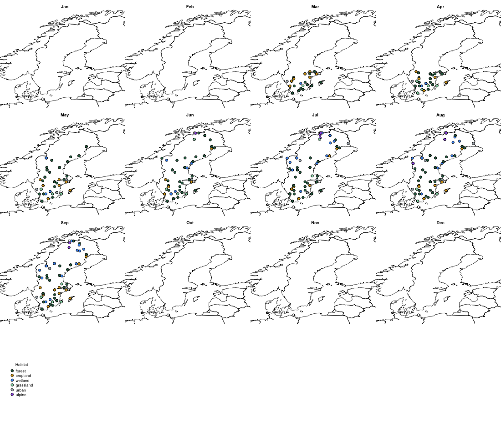
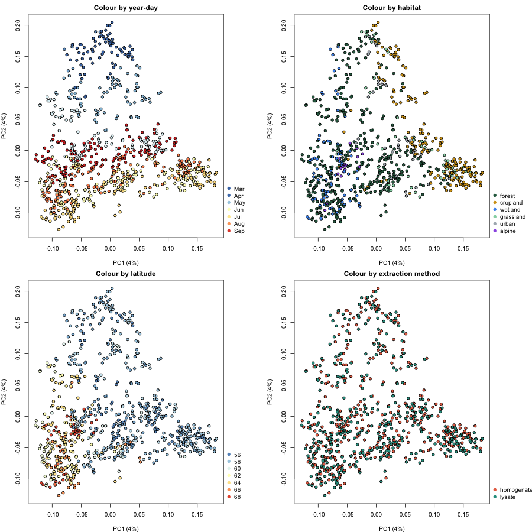
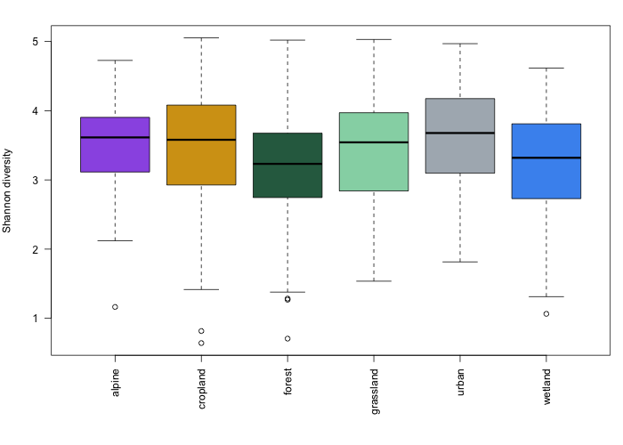
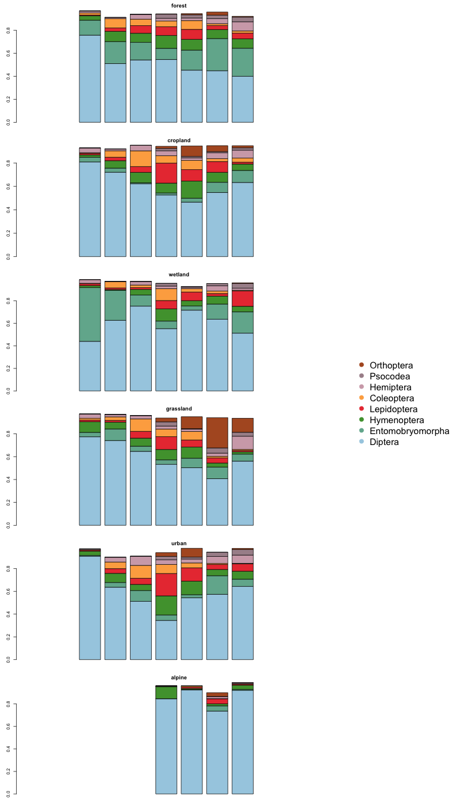

*Example results from running the tutorial on two combined IBA COI datasets, `IBA_CO1_homogenate_2019_SE` and `IBA_CO1_lysate_2019_SE` (downsampled and pooled), merged with `merge_data()`.*

---

### Sampling sites across Sweden

*Map of the balanced, pooled IBA sampling sites, coloured by habitat type.*

---

### Community differences — beta diversity (PCoA)

*Principal Coordinates Analysis (Spearman-based dissimilarity) of cluster-level community composition, coloured by year-day, habitat, latitude and extraction method. Homogenate and lysate samples are thoroughly mixed in the last panel — extraction method explains only ~0.3% of the variance in community composition (PERMANOVA), compared to ~5-6% for habitat — supporting pooling both for the rest of the analysis.*

---

### Within-sample diversity (alpha diversity) — Shannon index

*Diversity within each sample, by habitat — complementing the between-sample (beta diversity) view above.*

---

### Taxonomic composition by habitat

*Mean monthly relative abundance of the most common insect orders in each of the six habitat types.*

