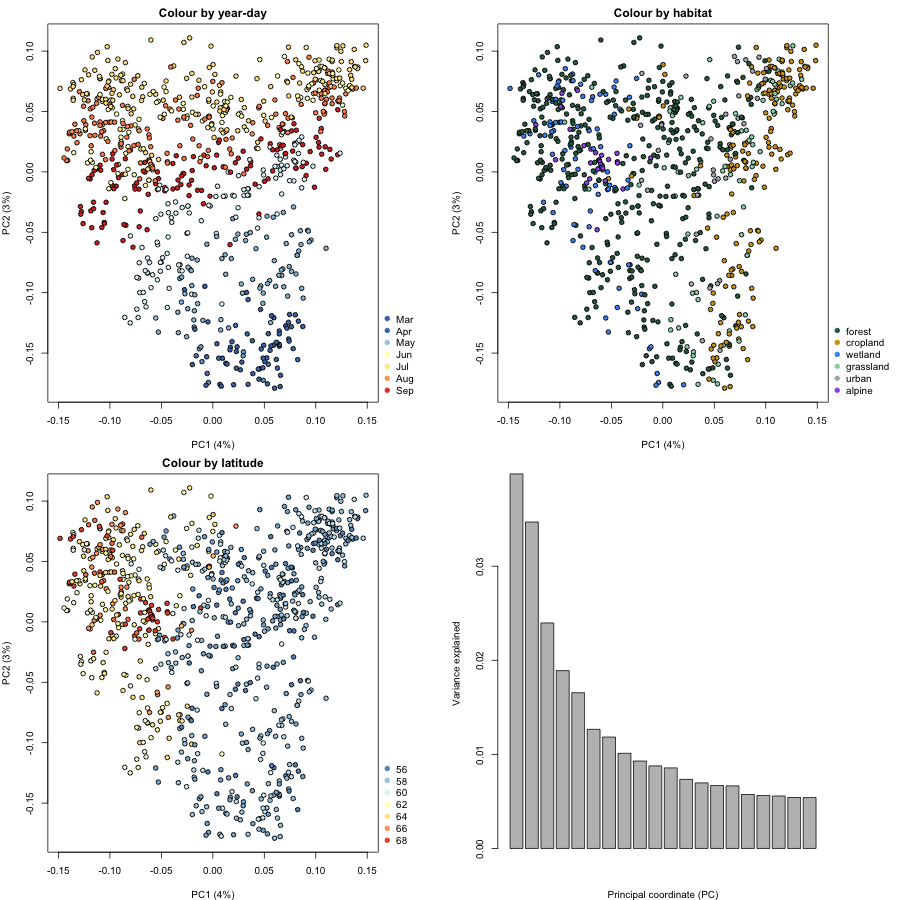
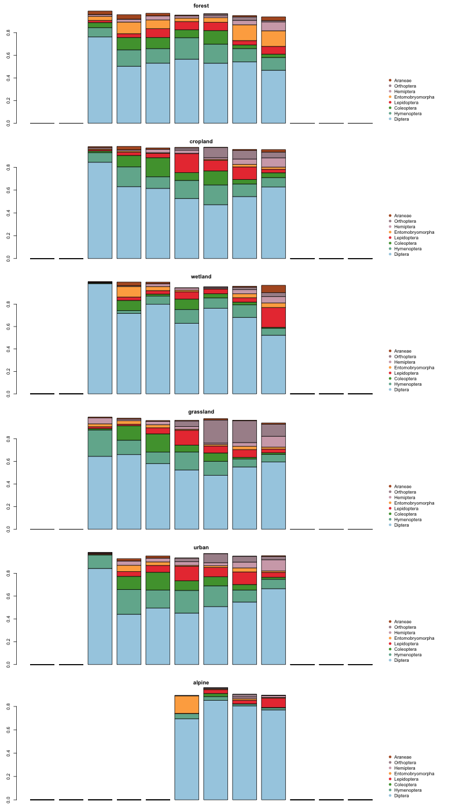

*Example results from running the tutorial on the IBA COI dataset `IBA_CO1_homogenate_2019_SE`, used here to validate the approach against previously known results before combining datasets.*

---

### Sampling sites across Sweden

*Map of the IBA sampling sites, coloured by habitat type.*

---

### Community structure (PCoA)

*Principal Coordinates Analysis (Spearman-based dissimilarity) of cluster-level community composition, coloured by year-day, habitat and latitude, plus variance explained per axis.*

---

### Taxonomic composition by habitat

*Mean monthly relative abundance of the most common insect orders in each of the six habitat types.*

