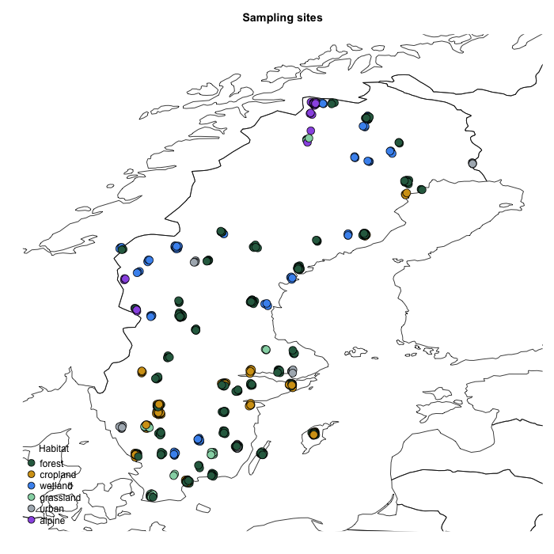

*Explore the spatial distribution of samples and their associated habitat types across Sweden.*

### Inspect contextual data

Core sample-level metadata is available in `merged_df$events`:

```r
colnames(merged_df$events)
```

Samples are ordered consistently across tables, which makes it straightforward to link sequence data with contextual data. Thus, `rownames(merged_df$events)`, `rownames(merged_df$emof)` and `colnames(merged$counts)` refer to the same samples.

---

### Extract spatial and temporal variables

```r
lat   <- as.numeric(merged_df$events$decimalLatitude)
lon   <- as.numeric(merged_df$events$decimalLongitude)
month <- lubridate::month(merged_df$events$eventDate)
yday  <- lubridate::yday(merged_df$events$eventDate)
```

::: {.callout-note}
`eventDate` is stored as a `start/end` interval string. If `month`/`yday` come back as `NA`, parse the start date explicitly instead:
```r
event_start <- lubridate::parse_date_time(
  sub("/.*", "", merged_df$events$eventDate),
  orders = c("ymd_HMSz", "ymd_HMS", "ymd", "y")
)
month <- lubridate::month(event_start)
yday  <- lubridate::yday(event_start)
```
:::

---

### Extract habitat type

The `env_local_scale` column contains habitat type classifications based on the [Environment Ontology](https://sites.google.com/site/environmentontology/){target="_blank"} (ENVO). We first inspect the unique values:

```r
unique(merged_df$events$env_local_scale)
```

For plotting, we create short labels and assign a colour to each habitat:

```r
habitat_map <- c(
  "forested area [ENVO:00000111]"    = "forest",
  "area of cropland [ENVO:01000892]" = "cropland",
  "wetland area [ENVO:00000043]"     = "wetland",
  "grassland area [ENVO]"            = "grassland",
  "urban biome [ENVO:01000249]"      = "urban",
  "alpine biome [ENVO:01001835]"     = "alpine"
)
habitat <- habitat_map[merged_df$events$env_local_scale]

habitat_cols <- c(
  "forest"    = "#2d6a4f",
  "cropland"  = "#d4a017",
  "wetland"   = "#4895ef",
  "grassland" = "#95d5b2",
  "urban"     = "#adb5bd",
  "alpine"    = "#9b5de5"
)
color_habitat <- habitat_cols[habitat]
```

---

### Map samples

We plot all sites on a map of Sweden, with point colour indicating habitat type. This does not distinguish between datasets — see [step 4](tutorial-04-pcoa.qmd) for a check of whether community structure differs between them.

Many samples share the same, or a nearby, physical site (repeated visits to the same trap over the season), so plotting raw coordinates hides most of them behind one another. A small amount of random jitter spreads out samples from the same site into a visible cluster instead of a single point:

```r
newmap <- rworldmap::getMap(resolution = "low")

set.seed(1)
lon_jit <- lon + rnorm(length(lon), 0, 0.03)
lat_jit <- lat + rnorm(length(lat), 0, 0.03)

par(mar = c(2, 2, 3, 1))
plot(newmap, xlim = c(10, 25), ylim = c(55, 70), asp = 1, main = "Sampling sites")
points(lon_jit, lat_jit, pch = 21, col = "black", bg = color_habitat, cex = 1.8)
legend("bottomleft", bty = "n", legend = names(habitat_cols),
       pt.bg = habitat_cols, pch = 21, pt.cex = 1.6, cex = 1.0,
       title = "Habitat")
```

::: {.callout-note}
**Spatial autocorrelation.** Many sample sites are close together (within ~10-15 km), so nearby samples are likely to share a regional species pool independent of habitat — beyond the scope of this tutorial, but worth keeping in mind before drawing strong conclusions about habitat effects from the PCoA in the next step.
:::

*Expected result (click to enlarge):*

[](figures/map.png){target="_blank"}

---

[← Previous](tutorial-02-prep.qmd) · [Overview](tutorial.qmd) · [Next →](tutorial-04-pcoa.qmd)
