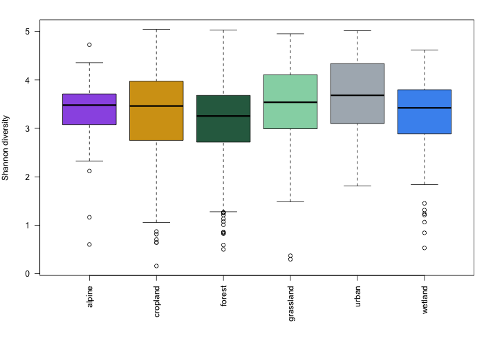

*Analyse community composition using a Spearman correlation-based dissimilarity and visualise patterns with a Principal Coordinates Analysis (PCoA), following the approach used in earlier IBA analyses of this data.*

This step closely follows the original analysis code, with one adaptation needed because `asvoccur` exposes the raw, un-clustered ASV table rather than a pre-clustered OTU table directly: we aggregate ASVs to clusters ourselves first (below), using the same cluster assignments the original analysis used.

### Aggregate ASVs to clusters

*Necessary adaptation:* `merged$counts` is indexed by individual ASV (hundreds of thousands of rows), whereas the original analysis worked from an already-clustered OTU table. The ASV portal data includes the same cluster assignments, in the `associatedSequences` column of each dataset's ASV table.

::: {.callout-note}
**Why read this from `loaded`, not `merged`?** `merge_data()` restricts `merged$asvs` to a fixed set of columns whenever it actually merges two or more datasets, dropping `associatedSequences` along the way. Reading from `loaded` instead — the per-dataset tables, before merging — keeps that column available.
:::

```r
cluster_lookup <- unique(data.table::rbindlist(lapply(loaded$asvs, function(x)
  x[, .(taxonID, associatedSequences)])))
cluster_id <- cluster_lookup$associatedSequences[match(rownames(merged$counts), cluster_lookup$taxonID)]

clevels <- unique(cluster_id)
cidx    <- match(cluster_id, clevels)
G <- Matrix::sparseMatrix(i = cidx, j = seq_along(cluster_id), x = 1,
                           dims = c(length(clevels), length(cluster_id)))
cluster_counts <- G %*% merged$counts
rownames(cluster_counts) <- clevels
nrow(cluster_counts)  # a fraction of the original ASV count
```

This reduces the row count enough on its own (e.g. ~7-fold for the homogenate dataset) that no further filtering is needed before densifying. `ix` here is the balanced, pooled sample set from [step 3](tutorial-03-map.qmd):

```r
counts_filt <- as.matrix(cluster_counts[, ix])
```

### Calculate a Spearman-based dissimilarity

```r
spear_cor  <- cor(counts_filt, method = "spearman")
spear_dist <- (-1 * spear_cor + 1) / 2   # rescale correlation to a 0-1 dissimilarity
```

### Run PCoA

```r
pcoa_res <- pcoa(spear_dist, correction = "cailliez")
```

### Prepare colour scales

`color_habitat`/`habitat_cols` were already built in [step 3](tutorial-03-map.qmd). We add two continuous colour scales, sized to the actual range of year-days/latitudes present (rather than a fixed 1-366 / full-latitude range) — otherwise, if the samples only span part of that range, they can all end up in one narrow, visually indistinguishable band of the palette — plus a colour pair for extraction method:

```r
ramp <- colorRampPalette(rev(c(
  "#D73027", "#FC8D59", "#FEE090", "#FFFFBF", "#E0F3F8", "#91BFDB", "#4575B4"
)))

yday_range <- min(yday[ix], na.rm = TRUE):max(yday[ix], na.rm = TRUE)
color_yday <- ramp(length(yday_range))
yday_index <- yday - min(yday_range) + 1

lat_range <- floor(min(lat[ix], na.rm = TRUE)):ceiling(max(lat[ix], na.rm = TRUE))
color_lat <- ramp(length(lat_range))
lat_index <- round(lat) - min(lat_range) + 1

method      <- dataset_id[ix]
method_cols <- c(IBA_CO1_homogenate_2019_SE = "#e76f51", IBA_CO1_lysate_2019_SE = "#2a9d8f")
method_labs <- c(IBA_CO1_homogenate_2019_SE = "homogenate", IBA_CO1_lysate_2019_SE = "lysate")
```

Latitude legend ticks use the same fixed 2-degree step as the original analysis. Year-day uses month names instead — point colour still varies continuously by day (so within-month variation is still visible), but a numeric day-of-year legend is harder to read than month names, and picking month starts naturally adapts to whatever period the data actually covers instead of assuming a step size:

```r
lat_ticks <- seq(ceiling(min(lat_range) / 2) * 2, max(lat_range), by = 2)

month_ticks  <- sort(tapply(yday[ix], month[ix], min))  # year-day of each month's first sample
month_labels <- month.abb[as.integer(names(month_ticks))]
```

### Plot PCoA results

We plot samples in PCoA space using the first two axes, once per colour variable — year-day, habitat, latitude, and extraction method:

```r
xlab <- paste0("PC1 (", round(pcoa_res$values$Rel_corr_eig[1] * 100), "%)")
ylab <- paste0("PC2 (", round(pcoa_res$values$Rel_corr_eig[2] * 100), "%)")

par(mfrow = c(2, 2), mar = c(4, 4, 2, 6), xpd = TRUE)

# Panel: colour by year-day
plot(pcoa_res$vectors[, 1], pcoa_res$vectors[, 2],
     col = "black", bg = color_yday[yday_index[ix]], pch = 21, cex = 1,
     xlab = xlab, ylab = ylab, main = "Colour by year-day")
legend("bottomleft", bty = "n", pch = 19, cex = 1, inset = c(1, 0),
       col = color_yday[month_ticks - min(yday_range) + 1],
       legend = month_labels)

# Panel: colour by habitat
plot(pcoa_res$vectors[, 1], pcoa_res$vectors[, 2],
     col = "black", bg = color_habitat[ix], pch = 21, cex = 1,
     xlab = xlab, ylab = ylab, main = "Colour by habitat")
legend("bottomleft", bty = "n", pch = 19, cex = 1, inset = c(1, 0),
       col = habitat_cols, legend = names(habitat_cols))

# Panel: colour by latitude
plot(pcoa_res$vectors[, 1], pcoa_res$vectors[, 2],
     col = "black", bg = color_lat[lat_index[ix]], pch = 21, cex = 1,
     xlab = xlab, ylab = ylab, main = "Colour by latitude")
legend("bottomleft", bty = "n", pch = 19, cex = 1, inset = c(1, 0),
       col = color_lat[lat_ticks - min(lat_range) + 1],
       legend = lat_ticks)

# Panel: colour by extraction method
plot(pcoa_res$vectors[, 1], pcoa_res$vectors[, 2],
     col = "black", bg = method_cols[as.character(method)], pch = 21, cex = 1,
     xlab = xlab, ylab = ylab, main = "Colour by extraction method")
legend("bottomleft", bty = "n", pch = 19, cex = 1, inset = c(1, 0),
       col = method_cols, legend = method_labs)
```

*Expected result (click to enlarge):*

[](figures/4_pcoa.png){target="_blank"}

Habitat, year-day and latitude separate out; extraction method does not — homogenate and lysate points are thoroughly mixed. A formal test (PERMANOVA, not shown here) confirms this: extraction method explains only ~0.3% of the variance in community composition, versus ~5-6% for habitat — small enough that pooling homogenate and lysate samples by habitat, as we do from here on, is reasonable.

---

### 4b. Alpha diversity: Shannon index by habitat

As a complementary view, we look at diversity *within* each sample using the [Shannon index](https://en.wikipedia.org/wiki/Diversity_index#Shannon_index){target="_blank"}, reusing the cluster-aggregated matrix from above instead of building a second large dense matrix:

```r
shannon <- vegan::diversity(counts_filt, MARGIN = 2)

par(mar = c(7, 4, 2, 1))
boxplot(shannon ~ habitat[ix], las = 2, xlab = "",
        ylab = "Shannon diversity",
        col = habitat_cols[levels(factor(habitat[ix]))])
```

While the PCoA above shows whether community *composition* differs between habitats (beta diversity), this shows whether some habitats simply host more diverse communities *within* a sample (alpha diversity) — a complementary, independent question.

*Expected result (click to enlarge):*

[](figures/4b_shannon.png){target="_blank"}

---

[← Previous](tutorial-03-map.qmd) · [Overview](tutorial.qmd) · [Next →](tutorial-05-barplots.qmd)
